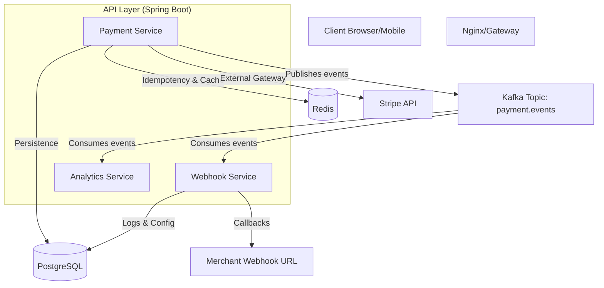

# FinPay Architecture Overview

FinPay is a high-performance, asynchronous multi-channel payment gateway built with a microservices-modular architecture.

## System Architecture

## Key Components

### 1. Payment Service (`apps/api/payment-service`)
- Handles transaction initiation and processing.
- Integrates with external payment providers (Stripe).
- Implements strict idempotency using Redis and PostgreSQL.
- Publishes status updates to Kafka.

### 2. Webhook Service (`apps/api/webhook-service`)
- Consumes Kafka events.
- Dispatches signed HTTP callbacks to merchants.
- Implements HMAC-SHA256 signing for security.
- Maintains exhaustive logs of delivery attempts.

### 3. Common Module (`apps/api/common`)
- Shares JPA entities, Repositories, DTOs, and Kafka Event objects.
- Contains the Flyway migration scripts.

### 4. Merchant Dashboard (`apps/web`)
- Next.js 16 application.
- Real-time display of transaction metrics.
- Modern dark-mode UI with Glassmorphism.
